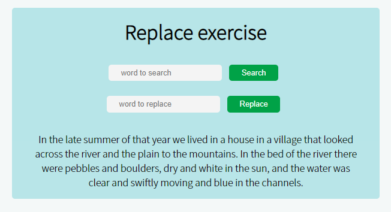
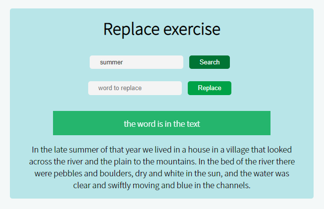
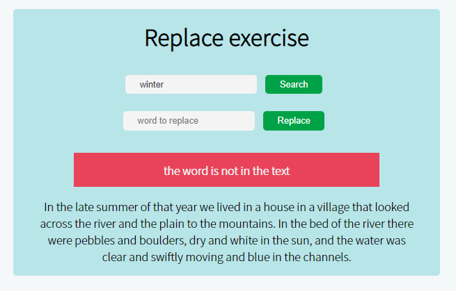
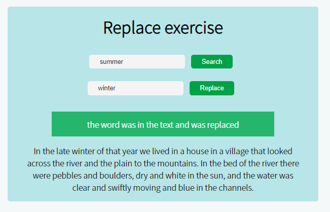
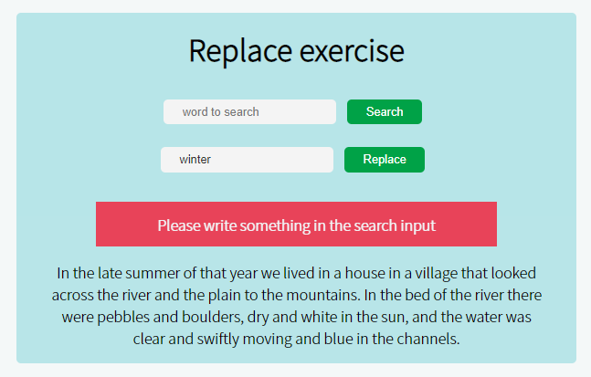

# Replace and Search method 
In the repository, there is an `index.html` starting file which has a text and inputs to search and replace words in the text. The goal of this task is to use the inputs to obtain words from the user and replace them if wanted. Also show a message showing what happened, if the word was found or not. Also message for if the word was replaced or not. There are also a `style.css` file with some classes, feel free to add more. And an `index.js` file for you to start there. If needed a more detailed explanation is found in the instructions. Also some images showing the end result.

## Important Concepts
For this task we will practice the selectors for the elements in the html document. For this task you will need to use 4 different ways of selecting elements from the document. 
- document.getElementById("id"). This method an element from the html document that match the same ID that you pass inside the parentheses.[more info here](https://developer.mozilla.org/en-US/docs/Web/API/Document/getElementById)

- string.search("search word"). This method of string type variables, search for the `"search word"` between parenthesis in the string. [More info here](https://developer.mozilla.org/en-US/docs/Web/JavaScript/Reference/Global_Objects/String/search)

- string.replaceAll("search word", "replace word"). This method of string type variables, search for the `"search word"` between parenthesis in the string, and then replace these words with the `"replace word"`. [More info here](https://developer.mozilla.org/en-US/docs/Web/JavaScript/Reference/Global_Objects/String/replaceAll)

**Rules and indications**: 
* All changes have to be done in the JavaScript File. No need to change the HTML, except for the content of the paragraph if you want to. The CSS can be changed also if you want to.
* Select the elements from the HTML document using the method you think will be better.
* The are some CSS classes already created that will be used in the task. The use of these classes are explained in the instructions.

**Instructions**: 
* Select the main elements from the HTML document that will be needed for the task. These are the `inputSearch`, `inputReplace`, `alert` and the `paragraph`. You could use `document.getElementById()` to obtain the elements.
* Change the display style of the alert to none to make sure it does not appear at the beginning 
* Inside the search function: 
  * Obtain the innerHTML from the `paragraph` and save it in a variable called for example text.
  * Obtain the value of the `inputSearch` and save it in a variable, called for example searchWord.
  * Now take the text variable and use the `search` method to search for the searchWord. Save the result in a new variable.
  * Change the display style of the alert to block.
  * now according to the result of the `search` method create an if statement. If `result < 0` it means that it couldn't find the word. If `result > 0` then the word is in the text. You can either use two if statements with different conditions or one if-else statement. 
  * ***For the case the word is in the text***. Assign the innerHTML of the `alert` to a message saying that the word is in the text.
  * Now we have to assign the correct class to the alert. As in this case the word is in the text the class is a success class. Then use the `classList.add()` method from the element to add a classes `alert` and `alert-success`.
  * Also to prevent confusion with the classes, remove the previous class that could be in the alert. For this use `classList.remove()` and inside the parenthesis the class we want to remove. In this case will be `alert-danger`, in case a danger alert appeared before.
  * ***For the case the word is NOT in the text***. Assign the innerHTML of the `alert` to a message saying that the word is not in the text.
  * Now we have to assign the correct class to the alert. In this case,  use the `classList.add()` method from the element to add a classes `alert` and `alert-danger`.
  * Also to prevent confusion with the classes, remove the previous class that could be in the alert. For this use `classList.remove()` and inside the parenthesis the class we want to remove. In this case will be `alert-success`, in case a success alert appeared before.
* Inside the replace function: 
  * Obtain the innerHTML from the `paragraph` and save it in a variable called for example text.
  * Obtain the value of the `inputSearch` and save it in a variable, called for example searchWord.
  * Obtain the value of the `inputReplace` and save it in a variable, called for example replaceWord.
  * It is needed to check that the searchWord is not empty. As if it is empty the `replaceAll` method will replace every word with the replaceWord. For this use an if-else statement. the condition will be that the searchWord is not an empty string (`searchWord !== '' `).
  * ***IN CASE THE SEARCHWORD IS NOT EMPTY*** take the text variable and use the `replaceAll` method to search for the searchWord, and replace all of them with the replaceWord. Save the result in a new variable.
  * Change the display style of the alert to block.
  * now according to the result of the `replaceAll` method create an if statement. If `result === text` it means that it couldn't find the word, and then the result of the `replaceAll` is the same as the original text. If `result !== 0` then the word was in the text and replaced with the new one. You can either use two if statements with different conditions or one if-else statement. 
  * ***For the case the word was in the text and was replaced***. Assign the innerHTML of the `alert` to a message saying that the word was in the text and was replaced.
  * Now we have to assign the correct class to the alert. As in this case the word was replaced the class is a success class. Then use the `classList.add()` method from the element to add a classes `alert` and `alert-success`.
  * Also to prevent confusion with the classes, remove the previous class that could be in the alert. For this use `classList.remove()` and inside the parenthesis the class we want to remove. In this case will be `alert-danger`, in case a danger alert appeared before.
  * ***For the case the word is NOT in the text***. Assign the innerHTML of the `alert` to a message saying that the word is not in the text.
  * Now we have to assign the correct class to the alert. In this case,  use the `classList.add()` method from the element to add a classes `alert` and `alert-danger`.
  * Also to prevent confusion with the classes, remove the previous class that could be in the alert. For this use `classList.remove()` and inside the parenthesis the class we want to remove. In this case will be `alert-success`, in case a success alert appeared before.
  * ***IN CASE THE SEARCHWORD IS EMPTY***. Assign the innerHTML of the `alert` to a message saying that the search word is empty.
  * Now we have to assign the correct class to the alert. In this case,  use the `classList.add()` method from the element to add a classes `alert` and `alert-danger` as the search word should not be empty.
  * Also to prevent confusion with the classes, remove the previous class that could be in the alert. For this use `classList.remove()` and inside the parenthesis the class we want to remove. In this case will be `alert-success`, in case a success alert appeared before.

**Images**:

**Notes**:
* Follow the instructions to perform the task. You can add any additional styling or functionality.
* Deadline: 2hrs.
* See reference images. 

