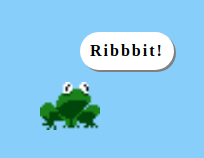

# Click Froggy!

Make a clickable froggy!

## Installation

Run `npm install`

## Usage

In the terminal, run the following command:

`npm run start`

## Advanced Usage

- To check your JavaScript with ESlint, run `npm run eslint`

## Assignments

We're going to make an interactive froggy which responds to various mouse click events. We'll be concentrating on the click (click), double-click (dblclick) and right-click (contextmenu) events.

These assignments assume you've already had experience with:
 
- writing HTML and CSS
- using the Math.random() method
- setTimeout

Things we will use / learn:

- Event listeners (mouse) (click)
- Event listeners (mouse) (dblclick)
- Event listeners (mouse) (contextmenu)
- Event listeners (window) (resize)
- Event method preventDefault()

### Assignment 1 - Groundwork

In the `styles/styles.css` file, modify the `body` styles:

1. Give the `body` a `background-color` of your choice

2. Set the `width` to 100 `vw` (100% viewport width)

3. Set the `height` to 100 `vh` (100% viewport height)

### Assignment 2 - Preparing our froggy

Froggy is missing! To show the froggy we need to prepare our HTML and CSS content.

In the `styles/styles.css` file:

1. Add a background image to the `froggy-sprite` CSS class. Use the image `/images/froggy.png`.

2. Give the `froggy-sprite` CSS class a width and a height.

3. The `froggy-speak` controls the styling for what the froggy says. Add your own styles to the `froggy-speak` CSS class to make it look more attractive.

4. Use the `visibility: hidden` property to hide the `.froggy-speak` CSS class (we will "unhide" it later with a click event) 

> Hint: A few properties you might like to use are `border-radius`, `letter-spacing`, `font-weight` and `box-shadow`

### Assignment 3 - Preparing our JavaScript

We need somewhere to store our JavaScript

1. Create a JavaScript file inside the `/js` folder

2. Import your new JavaScript file inside the `index.html`, by using the tag `` - replacing the value for `src` with the location of your JavaScript file. Make sure you place this code _after_ the `<body></body>` tag.

### Assignment 4 - Click the froggy and make it speak

Now we can see our frog, let's make the frog interactive!

1. Add an event listener on the `froggy-sprite` CSS class which listens for a mouse `click` event

2. In your callback for the "click" event, modify the `froggy-speak` CSS class so that the property `visibility: hidden` becomes `visibility: visible` for 200ms

> Hint: You will have to use `setTimeout` here to set the property back to `visibility: hidden`

Research: [EventTarget.addEventListener() [English]](https://developer.mozilla.org/en-US/docs/Web/API/EventTarget/addEventListener)

Research: [EventTarget.addEventListener() [Deutsch]](https://developer.mozilla.org/de/docs/Web/API/EventTarget/addEventListener)

### Assignment 5 - Jumping frog

Let's make the froggy jump to a different location when you double click on it.

1. Add an event listener on the `froggy-sprite` CSS class which listens for a mouse `dblclick` event

2. Outside of the listener create a new function called "froggyJump" which changes the `top` and `left` properties of the `froggy` CSS class to a random value from 0 to the height / width of the page

3. In your callback for the `dblclick` event, call the function "froggyJump"

> Hint: Use `Math.random()` to randomly pick a number

> Hint: Use `document.body.clientWidth` and `document.body.clientHeight` to set the maximum range for the random `top` and `left` values you generate

### Assignment 6 - No froggies left behind

You may notice at times the froggy appears outside of the page. We can use a bit of math to prevent this from happening.

1. Subtract the height of the `froggy` CSS class from the `document.body.clientHeight` - so your height range is limited, and the froggy will not appear off the screen. You can get the height of the `froggy` CSS class with the property `clientHeight`.

2. Subtract the width of the `froggy` CSS class from the `document.body.clientWidth` - so your width range is limited, and the froggy will not appear off the screen. You can get the width of the `froggy` CSS class with the property `clientWidth`.

### Assignment 7 - Right click froggy

Let's change the information which appears when you right-click on the froggy.

1. Add an event listener on the `froggy-sprite` CSS class which listens for a mouse "contextmenu" event. The "contextmenu" event fires when you right-click with the mouse.

2. In your callback for the "contextmenu" event, run the `preventDefault()` method on the event object.

3. Also in your callback for the "contextmenu" event, modify the `froggy-contextmenu` CSS class so that the property `display: none` becomes `display: block` for 1000ms

> Hint: Again you will have to use `setTimeout` here to set the property back to `display: none` to hide it again

### Assignment 8 - Window resizing

If we resize the page so that it is smaller than before, the froggy will appear outside of the visible area. We will fix this by re-positioning the froggy when the "resize" event fires.

1. Add an event listener on the `window` object which listens for a window "resize" event. The "resize" event fires when you resize the browser.

2. In your callback for the "resize" event, run the "froggyJump" function you created in Assignment 5.

## Credits

Graphical assets taken from https://opengameart.org/
