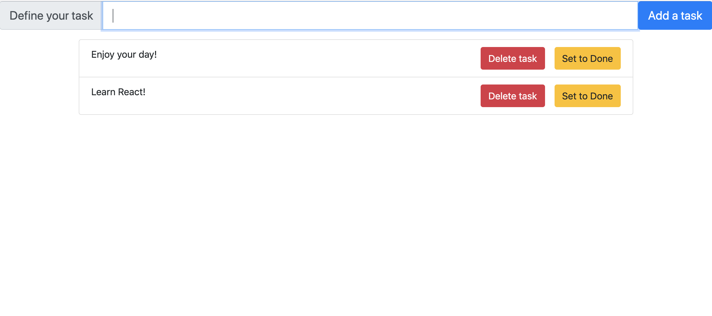

## Instructions for students:

### Create a ToDoList

-   The user should have the ability to add a _listItem_ through the input field.
-   The _listOfAllItems_ should be displayed for the user.
-   The user should be able to delete a _listItem_ and to mark it as complete.
-   Start the project with create react app.
-   Here is an image for reference:
    

**Bonuses**

-   The user should be able to edit an item.
-   Implement a react transition/animation when adding an item to the list.
-   User should be able to add an item by pressing the enter key as well as the button.

### Rules

-   This is an individual assignment.
-   Deadline: 2 Hrs.
-   Use **Git properly**
-   Feel free to document your code with comments.
