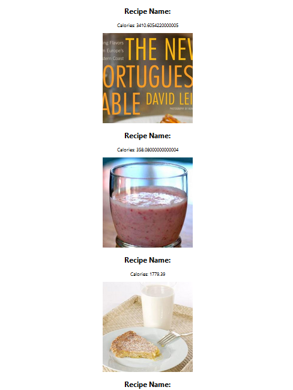

# React  Recipe Search APP
In this project you will be building a Recipe Search App in React Hooks.

The purpose of this assignment is to practise building a React application with Hooks.
1- signup for the API [here](https://developer.edamam.com/edamam-recipe-api) to read the  documentation about using this api [here](https://developer.edamam.com/edamam-docs-recipe-api)
2- Create a new project folder, using `create-react-app`

Use a folder name of your choice
3- you need to create your functional component and to create a state to save the recipes after fetching the data from the api, the state should be an array
```javascript 
import  React, {useState, useEffect} from  'react';

const  App = () => {
const [recipes, setRecipes] = useState([]);
}
```
4- you need to store `APP_ID`,`APP_KEY` in variables
```javascript 
const  APP_ID = "your app_id";

const  APP_KEY = "your app_key";

```
5- the url that you need to fetch is : 
```javascript 
const  API_URL = `https://api.edamam.com/search?q=milk&app_id=${APP_ID}&app_key=${APP_KEY}`;
```
you can test the api by searching for `q=milk` milk is the search word in this example
6- you need to use `useEffect` to fetch the data.
7- you can start with `Recipe` component this should have 
`recipe name` `calories` `image`

8- in your main component you can use map to render the Recepi component
```javascript
<Recipe  key={id}  title={item.recipe.title}  image={item.recipe.image}  calories={item.recipe.calories}  />
```
at the end you should have like this : 


9- after you can see some recipies you can create the SearchRecipe component then you need to have text input and search button or just text input the search word from the textinput should replace the `milk` word in our url
```javascript 
const  API_URL = `https://api.edamam.com/search?q=milk&app_id=${APP_ID}&app_key=${APP_KEY}`;

```
