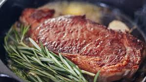

# authoring

# Github Flavoured Markdown

## THE list (most important list in existance today)
1. Click [here](https://help.github.com/en) for github documentation
2. IF you want to see the [images](/images) folder, click [here](/images) (or you can click on the word images :smiley:)
   - 
   - 
   - 
   - 

3. Emojis
   - :smiley:
   - :wink:
   - :sleeping:
   - :neckbeard:
   
|  | Name | Link | Checkbox |
| :--- | :---: | ---: | :---: |
| 1. | Steak | [Steak](/images/steak.jpeg) | :heavy_check_mark: |
| 2. | Chicken a la Kiev | [Chicken Kiev](/images/kiev.jpeg) | :ballot_box_with_check: |
| 3. | Burger | [Burger](/images/burger.jpeg) | :white_check_mark: |
| 4. | Pizza | [Pizza](/images/pizza.jpeg) | &#9744; |

| Nu. | Name | Emojis |
| :---: | :---: | :---: |
| 1. | Smiley | :smiley: |
| 2. |  Wink | :wink: |
| 3. | Sleeping | :sleeping: |
| 4. | Neckbeard? | :neckbeard: |

| header 1 | header 2 | header 3 |
| --- | :---: | ---: |
| content1 | content2 | content3 |
